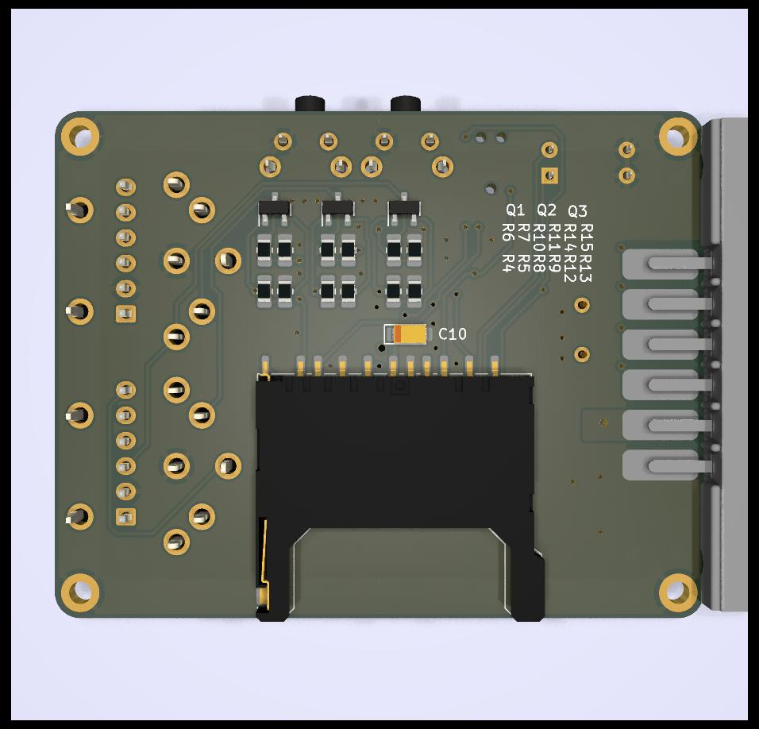

# SD2IEC
Rev A September 2022

### Basic Tests: works, with flaws

This version was built and minimal tests were performed. The footprint for the DIN connectors is wrong. **Don't put in the DIN connectors**. The alternate footprints are fine, I used a cable with a JST connector on one side and a male DIN on the other.

Rev B will have a corrected footprint and maybe more IO connectors (serial, LCD connectors were left out due to routing headache)

You can quote me on this: 
> Triple check your footprints with the real things.
Don't blindly trust a footprint diagram found on AliExpress - me

### Description

Yet another varion of the [SD2IEC](https://www.c64-wiki.com/wiki/SD2IEC) hardware device. From the wiki:

>The SD2IEC is a mass storage device using an SD/MMC card and interfacing with the IEC bus. It is based on the ATmega644 microcontroller from the Atmel AVR microcontroller family. The most prominent use of SD2IEC is replacement of a Commodore-1541 disk drive for a C64. The hardware and the microcontroller sd2iec firmware are available as open source

Compatible with C64, C64DTV, C128 (no burst mode), C16, VIC-20, etc.

### Features of this version:
* Nothing fancy, there are 1001 version out there, it's just mine
* ATmega1284p
	- more headspace
* Reset button
	- only resets the *drive*, not the whole computer nor the other drives
* Full size SD slot
	- *...which happens to be one I had on hand, so **triple check** the layout (holes and pads on the side) to see if it will fit with yours*
* Prev / Next buttons 
	- *Not even sure what they do, need to check the doc*
* Device selection DIP switches (8-11)
* Red / Green LEDs for activity, red flash on error, etc.
* Voltage regulator
	- MIC5504-3.3YM5 LDO regulator
		+ can probably be swapped with another regulator with same footprint
		+ don't put in more than ~6V (5.5 regulator max + diode drop)
		+ ...or less than 4V
	- Powers from the 5V on the datasette connector (optional). 
	- Can solder alternate 5V power source on pads 1 & 2
	- *I'll put in an alternate pin header in RevB...*
* Two DIN connectors with passthrough, so you can daisy chain with another drive or more.
	- **The footprint for the DIN connector is wrong in RevA, don't use it**
* Alternate footprint for the two IEC connectors: Can solder in 2.54mm pin headers instead of the DIN connectors 
	- I put a JST connector in there
	- **Again, don't use the DIN connectors with RevA!**
* The IEC lines are switched with MOSFETS (AO3400A) 
	- *...which are not recommended for new designs and surely out of stock everytwhere (everything is at the moment). There are probably direct replacements*
* Fancy tantalum capacitors which are surely overkill. Not sure what I was thinking. Don't put 'em backwards

Images
============
|Front                                                 | Back                                              |
|------------------------------------------------------|---------------------------------------------------|
|||

### Schematics (pdf)
- [Complete schematics](./img/schema.pdf)

### PCB Images (svg)
- [Top](./img/pcb-front.svg)
- [Bottom](./img/pcb-back.svg)
